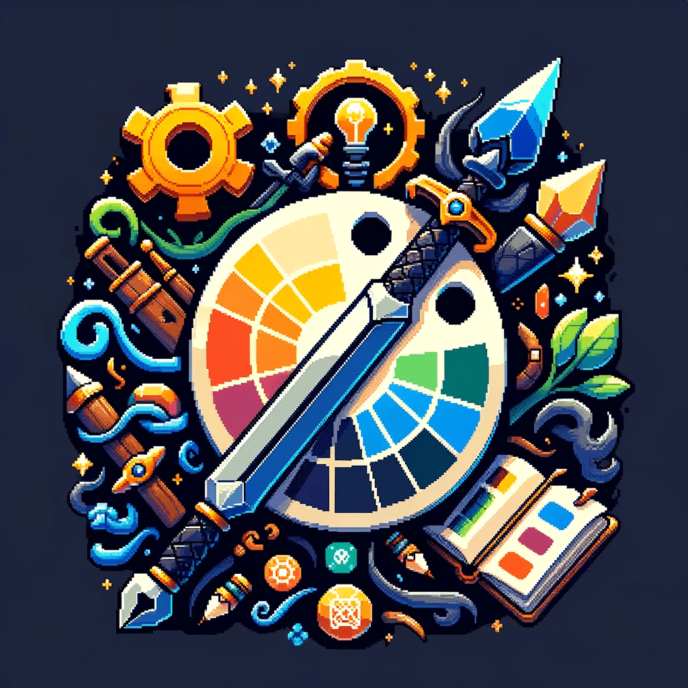
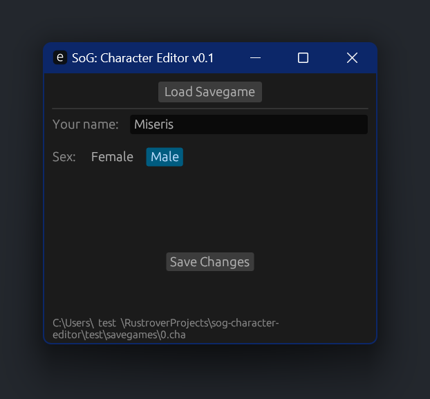

    

<h1 align="center"> SoG Character Editor </h1>

 
      
  <!---->

 

 
SoG Character Editor is a tool for changing the name and gender in the  <a href="https://store.steampowered.com/app/269770/Secrets_of_Grindea/">Secrets of Grindea</a> character savegames.  
It is basically a stripped down version of the <a href="https://github.com/tolik518/SoG_SGreader">SoG Savegame Editor</a>.

 

## Download
Head over to the releases if you are just here for the [download link](https://github.com/tolik518/sog-character-editor/releases), then press on `Assets`   
on the latest version and download the `sog-character-editor.zip` file. 

Or just [press here](https://github.com/tolik518/sog-character-editor/releases/latest/download/sog-character-editor.exe) to download the latest version.

**Hint**: *You just want to change more than just your **name** and **gender** then head over to the full blown [Savegame Editor](https://github.com/tolik518/SoG_SGreader)*

###### Disclaimer: The icon was generated using DALL-E 2 by OpenAI.
