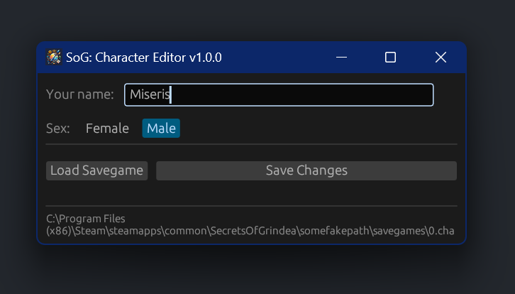

    

<h1 align="center"> SoG Character Editor </h1>

 
SoG Character Editor is a tool for changing the name and gender in the  <a href="https://store.steampowered.com/app/269770/Secrets_of_Grindea/">Secrets of Grindea</a> character savegames.  
It is basically a stripped down version of the <a href="https://github.com/tolik518/SoG_SGreader">SoG Savegame Editor</a>.

 

Download can be found on the [Releases](https://github.com/tolik518/sog-character-editor/releases) page.
Just head over there and download the ".exe" of the latest version.

###### Disclaimer: The icon was generated using DALL-E 2 by OpenAI.